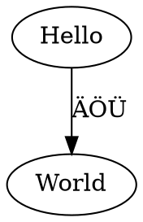

---
title: Inline GraphViz images
...

Code blocks with class `graphviz` are replaced by images generated with GraphViz. For instance:

    ```graphviz
    digraph G {Hello->World [label="ÄÖÜ"]}
    ```

is replaced by



Image captions are possible with attribute `caption` and additional attributes are preserved, for instance to [link to an image](#image).

```{.graphviz #image caption="this is the caption" width=5cm}
digraph G {Hello->World [label="ÄÖÜ"]}
```

Attribute `option` (or `options`) can be used to select another GraphViz layout engine:

```{.graphviz option="-Kcirco"}
digraph G {A->B; B->C; C->D; D->A}
```

