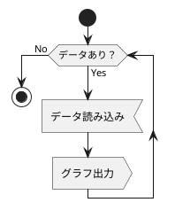
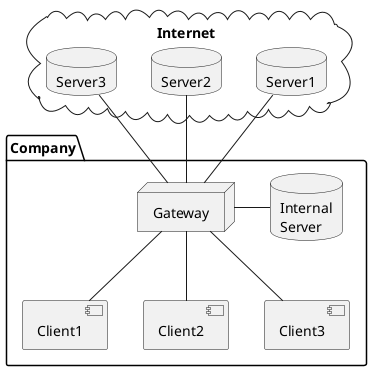

% PlantUML Filter Sample

## Sequence Diagram

```{#sequence_diagram_1 .plantuml}
@startuml
Alice -> Bob: Authentication Request
Bob --> Alice: Authentication Response

Alice -> Bob: Another authentication Request
Alice <-- Bob: another authentication Response
@enduml
```

## Activity Diagram



## Component Diagram


